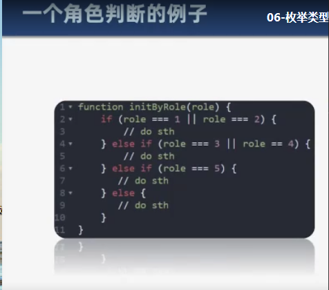
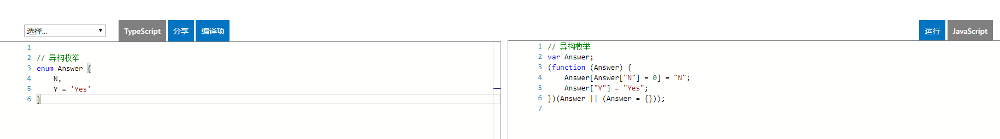
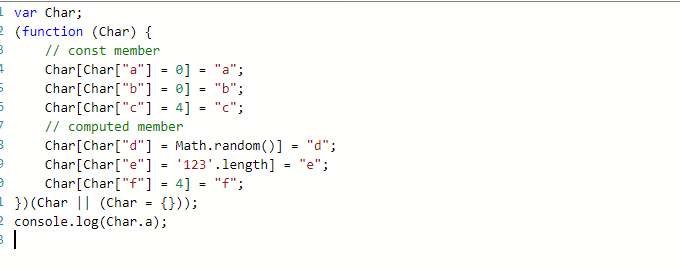

# 枚举类型

**接口类型的引入的原因**
可读性差
维护性差



##修改角色判断 例子
```javaScript
    enum Role {
        Reporter = 1,
        Developer,
        Maintainer,
        Owner,
        Guest
    }
    function initRule(role){
        if(Role[role] ===1){
            //do something
            console.log(1)
        }else if(Role[role] ===2 ){
             console.log(2)

        }
    }

```

##什么是枚举


## 数字枚举

**枚举成员值默认从0开始递增**

```javaScript
// 数字
enum Role {
    Reporter = 1,
    Developer,
    Maintainer,
    Owner,
    Guest
}// 初始值默认是0  也可以定义初始值
```
## 字符串枚举

**不支持反向映射**

```javaScript
    // 字符串枚举
enum Message {
    Success = '恭喜你，成功了',
    Fail = '抱歉，失败了'
}
```
## 异构枚举

```javaScript
    
// 异构枚举
enum Answer {
    N,
    Y = 'Yes'
}
```


## 枚举成员
**常量枚举成员:1)无初始值 2)对常量成员的引用 3)常量表达式 在编译阶段被计算出的结果
计算枚举成员: 表达式保留到程序的执行阶段 后面的成员要添加初始值**

```JavaScript
// 枚举成员
// Role.Reporter = 0
enum Char {
    // const member  
    a,
    b = Char.a,
    c = 1 + 3,
    // computed member
    d = Math.random(),
    e = '123'.length,
    f = 4
}

```



## 常量枚举

```javaScript
// 常量枚举
**编译后被移除 成员只能为const member**
const enum Month {
    Jan,
    Feb,
    Mar,
    Apr = Month.Mar + 1,
    // May = () => 5
}
let month = [Month.Jan, Month.Feb, Month.Mar]

```

##枚举类型

```JavaScript
// 枚举类型
enum E { a, b }//无任何初始值
enum F { a = 0, b = 1 }//
enum G { a = 'apple', b = 'banana' }

let e: E = 3
let f: F = 3
// console.log(e === f)

let e1: E.a = 3
let e2: E.b = 3
let e3: E.a = 3
// console.log(e1 === e2)
// console.log(e1 === e3)

let g1: G = G.a
let g2: G.a = G.a
```