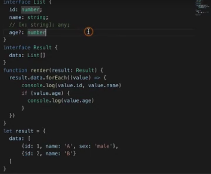

# 接口
## 对象类型接口
* 检查类型:鸭式变型法
>传入的对象满足接口的必要条件 


* 绕过字面量检查  

    * 将对象字面量赋值变量 
    * 使用类型判断  
    
    <!-- 2019-09-03_175318.png -->
    
    * 使用字符串索引签名
    
* 对象的属性
    * 可选属性
    > 新的需求 判断value是否有age属性 如果有就进行打印 此时数据中并没有age属性索引ts会进行报错

    
    > 在list中加入age属性后还收报错 这时便会用到可选属性

    

    * 只读属性 是不可以修改的

    

````JavaScript
//定义对象接口类型
interface List {
    id:number,
    name:string
}
interface Result{
    data:List[]
}
function render(result:Result){
    result.data.forEach((value)=>{
        console.log(value.id,value.name))
    })
}
let result = {
    data: [
        {id: 1, name: 'A', sex: 'male'},
        {id: 2, name: 'B', age: 10}
    ]
}
render(result)
````    

## 可索引类型接口
## 函数类型接口
> 使用变量定义一个函数
````JavaScript
//变量定义函数
let add: Add = (a: number, b: number) => a + b
//接口定义函数 直接定义函数的参数类型
interface Add{
    (x:number,y:number):number
}
//使用类型别名
type Add = (x: number, y: number) => number
let add:Add =(a:number,b:number)=>a+b
````
## 混合类类接口


<!-- 2019-09-03_182514.png -->
````javaScript

interface Lib {
    (): void;
    version: string;
    doSomething(): void;
}

function getLib() {
    let lib = (() => {}) as Lib
    lib.version = '1.0.0'
    lib.doSomething = () => {}
    return lib;
}
let lib1 = getLib()
lib1()
let lib2 = getLib()
lib2.doSomething()

````
## 类类型接口
## 接口继承接口
## 接口继承类
