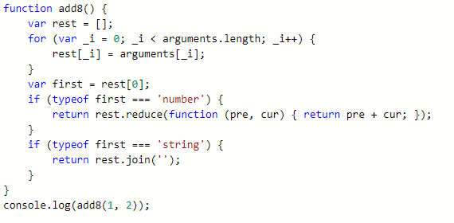

# 函数

## 定义方法
* function
````JavaScript
function add1(x: number, y: number) {
    return x + y
}
````
* 定义变量
````JavaScript
let add2: (x: number, y: number) => number
````
* 类型别名
````JavaScript
type add3 = (x: number, y: number) => number
````
* 接口定义
````JavaScript
interface add4 {
    (x: number, y: number): number
}
````
## 类型要求
* 参数类型必须声明

* 返回值类型一般无需声明

## 函数参数

### 参数个数
* 实参与形参必须一一对应
```JavaScript
//多一个不行 少一个也不行
function add1(x: number, y: number) {
    return x + y
}
add1(1, 2, 3)
```
### 可选参数

* 必选参数不能位于可选参数后
````JavaScript
function add5(x: number, y?: number) {
    return y ? x + y : x
}
add5(1)
````
### 默认参数
* 在必选参数前,默认参数不可省略

* 在必选参后,默认参数可以省略
````JavaScript
function add6(x: number, y = 0, z: number, q = 1) {
    return x + y + z + q
}
add6(1, undefined, 3)//5
````
### 剩余参数
````JavaScript
function add7(x: number, ...rest: number[]) {
    return x + rest.reduce((pre, cur) => pre + cur);
}
add7(1, 2, 3, 4, 5)

````
## 函数重载

### 静态类型语言

> 函数名称相同,参数个数或者类型不同

### TypeScript

> 预先定义一组名称相同,类型不同的函数声明, 并在一个类型最宽松的版本中实现
````JavaScript
function add8(...rest: number[]): number;
function add8(...rest: string[]): string;
function add8(...rest: any[]) {
    let first = rest[0];
    if (typeof first === 'number') {
        return rest.reduce((pre, cur) => pre + cur);
    }
    if (typeof first === 'string') {
        return rest.join('');
    }
}
console.log(add8(1, 2))
console.log(add8('a', 'b', 'c'))
````
